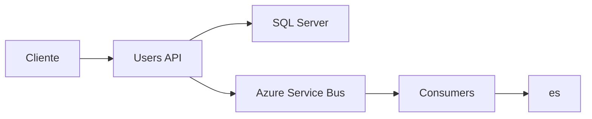
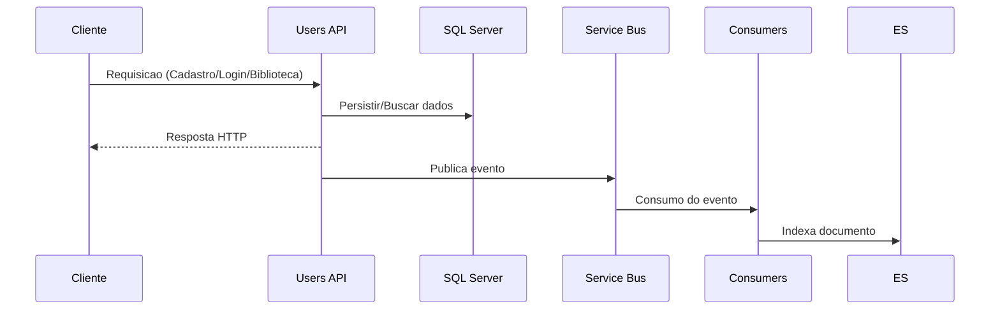
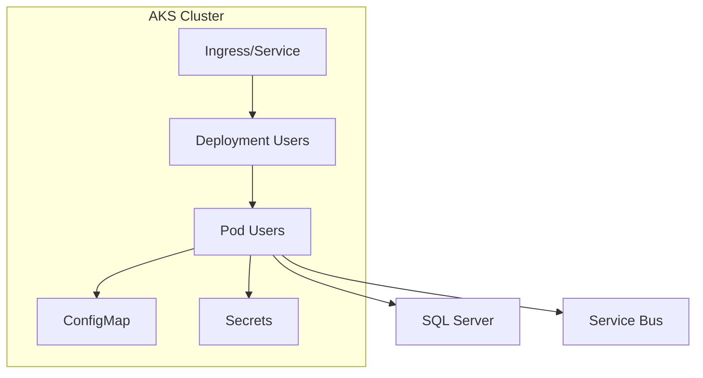

# SolidarityConnection

API de Users do projeto SolidarityConnection. Responsavel por cadastro, autenticacao, biblioteca e integracao com Service Bus.

## Conteudo

- Visao geral
- Estrutura do repositorio
- Requisitos
- Executar localmente
- Testes
- Docker
- Kubernetes (AKS)
- Configuracoes
- Pipelines

## Visao geral

Este servico expoe endpoints REST para operacoes de usuarios, autenticacao e biblioteca. Ele utiliza:

- SQL Server para persistencia
- Azure Service Bus para mensageria

## Arquitetura e fluxo



## Fluxo da aplicacao



## Estrutura do repositorio

 src/SolidarityConnection.Api: API Web
 src/SolidarityConnection.Application: regras de negocio
 src/SolidarityConnection.Domain: modelos de dominio
 src/SolidarityConnection.Infrastructure: persistencia e integracoes
 src/SolidarityConnection.Shared: contratos e utilitarios
 tests/SolidarityConnection.Tests: testes automatizados
- k8s/: manifests Kubernetes
- pipeline/: Azure Pipelines

## Requisitos

- .NET SDK 8.x
- Docker
- kubectl
- Azure CLI (para AKS)

## Executar localmente

1) Restaurar dependencias:

```bash
dotnet restore SolidarityConnection.sln
```

2) Executar a API:

```bash
dotnet run --project src/SolidarityConnection.Api/SolidarityConnection.Api.csproj
```

## Validacao local fim a fim (Core + Donations)

Para a correcao do projeto com os dois microsservicos rodando localmente via Docker Compose, use o guia completo:

- `others/docs/validacao-local-docker-compose.md`

Resumo rapido:

1) Criar `.env` na raiz com conexoes de banco, Service Bus e JWT.
2) Criar `docker-compose.validation.yml` na raiz do repositorio Core.
3) Executar build e subida:

```bash
docker compose -f docker-compose.validation.yml build
docker compose -f docker-compose.validation.yml up -d
```

4) Validar health checks:

```bash
curl http://localhost:8080/health
curl http://localhost:8081/health
```

5) Validar fluxo funcional:

- login/autenticacao;
- envio de doacao em `POST /api/donations`;
- consulta em `GET /api/campaigns/public` com `total_raised_amount` atualizado.

6) Derrubar ambiente:

```bash
docker compose -f docker-compose.validation.yml down
```

## Testes

```bash
dotnet test SolidarityConnection.sln -c Release
```

## Docker

Build da imagem:

```bash
docker build -f src/SolidarityConnection.Api/Dockerfile -t solidarity-connection:local .
```

Executar localmente:

```bash
docker run -p 8080:80 solidarity-connection:local
```

## Kubernetes (AKS)

Manifests estao em k8s/.

Aplicar:

```bash
kubectl apply -f k8s/configmap.yaml
kubectl apply -f k8s/service.yaml
kubectl apply -f k8s/deployment.yaml
kubectl apply -f k8s/hpa.yaml
```

Verificar rollout:

```bash
kubectl rollout status deployment/solidarity-connection
```

## Arquitetura no Kubernetes



## Configuracoes

Variaveis principais (exemplos):

- ConnectionStrings__DefaultConnection (Secret)
- ServiceBus__ConnectionString (Secret)
- JwtSettings__SecretKey (Secret)
- JwtSettings__Issuer (Secret)
- JwtSettings__Audience (Secret)

## Pipelines

O pipeline esta em pipeline/azure-pipelines.yml e executa:

- Build
- Testes
- Build/Push da imagem
- Deploy no AKS (branches develop e main)

## Roteiro de apresentacao (15 minutos)

Para o video final com a sequencia completa de demonstracao:

- `others/docs/roteiro-video-apresentacao-15min.md`

