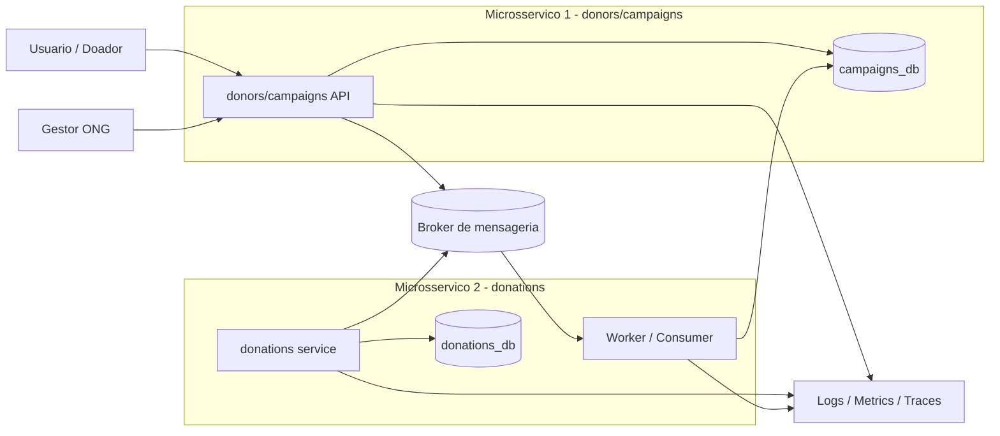

# Arquitetura de Microsservicos - Donors/Campaigns e Donations

## Objetivo

Este documento descreve uma arquitetura com dois microsservicos para atender ao requisito do hackathon:

- `donors/campaigns`: responsavel por autenticao, cadastro de doadores e gestao de campanhas.
- `donations`: responsavel por receber e processar doacoes de forma assincrona.

A separacao reduz acoplamento, deixa o processamento de doacoes resiliente e permite que cada servico tenha seu proprio banco de dados.

## Visao geral

O fluxo principal e este:

1. O usuario envia uma doacao para o servico `donations` ou para a API de dominio.
2. O servico grava a transacao no seu proprio banco.
3. O servico publica um evento em um broker de mensageria.
4. O outro microsservico consome o evento e atualiza o dado derivado no banco que ele possui.

O ponto mais importante e que nenhum microsservico escreve diretamente no banco do outro. Cada servico e dono do proprio armazenamento.

## Diagrama



## Responsabilidades por microsservico

### 1. donors/campaigns

Responsabilidades:

- autenticar usuarios;
- cadastrar doadores;
- gerenciar campanhas;
- expor consultas publicas de campanhas ativas;
- manter o estado consolidado da campanha, como meta, status e total arrecadado.

Banco de dados:

- `campaigns_db`
- tabelas tipicas: `users`, `campaigns`, `campaign_status_history`, `campaign_balance`.

Observacao:

- este e o banco dono do dominio de campanhas;
- o worker nunca escreve em um banco compartilhado global.

### 2. donations

Responsabilidades:

- receber a intencao de doacao;
- validar dados basicos de entrada;
- registrar a doacao e seu status;
- publicar evento no broker;
- processar retries, idempotencia e trilha de auditoria, se necessario.

Banco de dados:

- `donations_db`
- tabelas tipicas: `donations`, `donation_status`, `outbox`, `processing_log`.

Observacao:

- este banco guarda a operacao de doacao e seu historico;
- ele nao substitui o banco de campanhas.

## Papel do worker

O worker e o consumidor assincrono do evento de doacao.

Ele faz o seguinte:

- consome a mensagem do broker;
- valida se a mensagem ainda nao foi processada;
- atualiza o total arrecadado da campanha no `campaigns_db`;
- registra o resultado do processamento;
- em caso de erro, aplica retry e pode mandar para uma fila de falha.

Na pratica, o worker nao recebe requisicao HTTP do usuario. Ele existe para tirar do caminho da API o processamento que pode falhar, atrasar ou precisar de retry.

## Como ficam os bancos

### Opcao recomendada

- `campaigns_db` para o servico de campanhas e usuarios.
- `donations_db` para o servico de doacoes.

Vantagens:

- separacao real de responsabilidades;
- menor acoplamento;
- cada microsservico e escalado e versionado de forma independente;
- mais facil justificar a arquitetura na avaliacao.

### O que evitar

- um banco unico compartilhado pelos dois servicos;
- o worker escrevendo diretamente no banco de usuarios;
- um servico lendo e alterando dados internos do outro fora de contrato.

## Fluxo de escrita

### 1. Criacao da doacao

- O cliente chama a API de doacoes.
- O servico grava a doacao em `donations_db`.
- O servico publica `DonationReceivedEvent` no broker.

### 2. Consumo pelo worker

- O worker consome o evento.
- O worker identifica a campanha alvo.
- O worker atualiza o total arrecadado em `campaigns_db`.
- O worker confirma o processamento.

### 3. Consulta publica

- A API de campanhas le os dados consolidados do `campaigns_db`.
- A listagem publica mostra campanha ativa, meta e total arrecadado.

## Contratos de evento

Exemplo de evento:

```json
{
  "donationId": "d9a1b6c4-8f1f-4f1d-9a9f-1d5f9b8f7f20",
  "campaignId": "b1c3f8c9-1c1b-4d5e-9d88-3b4f10f1a111",
  "donorId": "a3c2d1e0-1234-5678-9abc-0f1e2d3c4b5a",
  "amount": 150.00,
  "createdAt": "2026-04-20T12:00:00Z"
}
```

Campos importantes:

- `donationId`: garante idempotencia;
- `campaignId`: define qual campanha sera atualizada;
- `amount`: valor que entra no acumulado;
- `createdAt`: ajuda em auditoria e rastreabilidade.

## Regras de consistencia

- a API nao deve atualizar o total arrecadado diretamente no mesmo fluxo da requisicao;
- o worker precisa ser idempotente;
- mensagens duplicadas nao podem somar duas vezes;
- falhas temporarias devem ser tratadas com retry;
- falhas persistentes devem ir para DLQ ou tratamento manual.

## Beneficios do desenho

- atende o requisito de pelo menos dois microsservicos;
- mostra separacao clara entre API e processamento assincrono;
- evita banco compartilhado entre dominios;
- permite escalar o worker separadamente da API;
- deixa a explicacao do hackathon mais facil de defender.

## Resumo executivo

Se a solucao tiver apenas dois microsservicos, o desenho mais coerente e este:

- `donors/campaigns` com seu proprio banco;
- `donations` com seu proprio banco;
- broker de mensageria para integrar os dois;
- worker consumindo os eventos e atualizando o estado consolidado da campanha.

Esse arranjo cumpre a separacao de responsabilidades e o requisito de processamento assincrono da doacao.