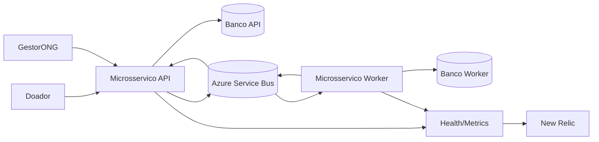

# Arquitetura de Microsservicos - Conexao Solidaria (MVP)

## Objetivo

Definir a arquitetura minima para atender aos requisitos obrigatorios do hackathon, sem adicionar escopo extra.

## Padronizacao de termos

- User: conta tecnica autenticavel do sistema.
- Doador: persona de negocio representada por um User com role `Doador`.
- GestorONG: persona de negocio representada por um User com role `GestorONG`.

Regra de escrita deste documento:

- Quando o assunto for autenticacao, autorizacao e modelo de conta, usar o termo User.
- Quando o assunto for processo de doacao, usar o termo Doador.

## Glossario rapido

- User e Doador referenciam a mesma pessoa no MVP; a diferenca esta no contexto (tecnico vs. negocio).

## Requisitos funcionais (escopo do MVP)

1. Autenticacao com JWT e autorizacao por roles `GestorONG` e `Doador`.
2. Gestao de campanhas (somente `GestorONG`): criar e editar campanha com:
   - `Titulo`, `Descricao`, `DataInicio`, `DataFim`, `MetaFinanceira`, `Status` (`Ativa`, `Concluida`, `Cancelada`).
   - Regras: `DataFim` nao pode estar no passado e `MetaFinanceira` deve ser maior que zero.
3. Cadastro publico de doador com:
   - `NomeCompleto`, `Email` unico, `CPF` valido, `Senha` com hash (ex.: BCrypt).
4. Painel de transparencia publico:
   - listar somente campanhas `Ativa`.
   - retornar `Titulo`, `MetaFinanceira`, `ValorTotalArrecadado`.
5. Processo de doacao (doador logado):
   - enviar `IdCampanha` e `ValorDoacao`.
   - regra: nao permitir doacao para campanha `Concluida` ou `Cancelada`.

## Requisitos tecnicos obrigatorios

1. Pelo menos dois microsservicos distintos.
2. Comunicacao assincrona com broker (Azure Service Bus).
3. A API nao atualiza `ValorTotalArrecadado` diretamente no recebimento da doacao.
4. Um Worker/Consumer processa o evento de doacao e atualiza o total arrecadado.
5. Execucao em Kubernetes com manifestos `Deployment`, `Service` e `ConfigMap`.
6. Observabilidade com endpoint de saude/metricas e dashboard no New Relic com dados reais.
7. Pipeline CI/CD acionado em push na branch principal, com build .NET e geracao de imagem Docker.

## Arquitetura minima proposta

### Microsservico 1 - API (Usuarios e Campanhas)

- Responsavel por autenticacao/autorizacao, cadastro de doador, gestao de campanhas e endpoint publico de campanhas ativas.
- Tambem expoe a API de doacao (intencao de doacao), por exemplo: `POST /doacoes` com `IdCampanha` e `ValorDoacao`.
- Persiste dados de usuarios/campanhas em banco proprio.
- Consome `DonationProcessedEvent` e atualiza o `TotalRaisedAmount` no proprio banco.

Tabelas sugeridas (Banco API):

- `users`
   - `id` (PK)
   - `full_name`
   - `email` (UNIQUE)
   - `cpf` (UNIQUE)
   - `password_hash`
   - `role` (`GestorONG` ou `Doador`)
   - `created_at`
- `campaigns`
   - `id` (PK)
   - `title`
   - `description`
   - `start_date`
   - `end_date`
   - `financial_goal`
   - `status` (`Active`, `Completed`, `Canceled`)
   - `total_raised_amount`
   - `created_at`, `updated_at`

### Microsservico 2 - Worker de Doacoes

- Consome evento `DonationReceivedEvent` do broker.
- Valida e processa a mensagem.
- Persiste dados operacionais de doacao em banco proprio (idempotencia e status de processamento).
- Publica `DonationProcessedEvent` no broker para que o servico de campanhas atualize seu proprio banco.

Tabelas sugeridas (Banco Worker):

- `donations`
   - `id` (PK, `donationId`)
   - `campaign_id`
   - `donor_id`
   - `donation_amount`
   - `status` (`Received`, `Processing`, `Processed`, `Failed`)
   - `attempts`
   - `error_message`
   - `received_at`
   - `processed_at`
   - `last_retry_at`

### Broker de mensageria

- Canal assincrono entre API e Worker.
- Tecnologia adotada: Azure Service Bus.

## Fluxo obrigatorio de doacao

1. Doador autenticado envia intencao de doacao para a API.
2. API valida regras de negocio e publica `DonationReceivedEvent` no broker.
3. Worker consome o evento, processa a doacao e publica `DonationProcessedEvent`.
4. API de Campanhas consome `DonationProcessedEvent` e atualiza o `TotalRaisedAmount` no proprio banco.
5. Endpoint publico passa a refletir o valor atualizado.

## Validacoes por servico

- API (antes de publicar `DonationReceivedEvent`):
   - doador autenticado;
   - campanha existente e com status `Ativa`;
   - `ValorDoacao` maior que zero.
- Worker (no processamento assincrono):
   - idempotencia (nao processar a mesma doacao duas vezes);
   - consistencia tecnica da mensagem;
   - controle de tentativas e falhas.

## Esclarecimentos de fronteira

- Onde fica a API de doacao: no Microsservico 1 (API), junto com autenticacao e campanhas.
- O Worker atualiza banco de outro microsservico: nao. O Worker so acessa o proprio banco e se comunica por eventos.
- Regra de ouro preservada: cada microsservico escreve apenas no proprio banco.
- Replica de dados de campanha e doador no Worker: nao no MVP. Para manter simplicidade, o Worker nao replica entidades completas; ele processa a doacao com base no evento recebido e nas validacoes ja feitas pela API.
- Inbox/Outbox: nao sera usado no MVP, por decisao de simplificacao do projeto de estudo.

## Excecoes aprovadas para esta entrega

- Broker definido como Azure Service Bus (SB).
- Observabilidade definida com New Relic.
- As escolhas acima foram aprovadas pelo professor para esta turma.

## Diagrama (alto nivel)

## Infraestrutura obrigatoria de entrega

- Kubernetes: `Deployment`, `Service`, `ConfigMap`.
- Observabilidade: endpoint `/health` ou `/metrics` + dashboard New Relic.
- CI: build .NET + geracao de imagem Docker a cada push na branch principal.

## Fora de escopo deste plano

- API Gateway.
- Regras de negocio adicionais nao exigidas.
- Componentes extras nao solicitados no enunciado.